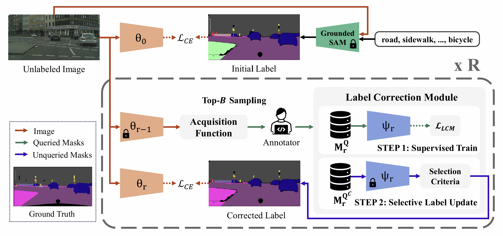

<h1 align="center">
A²LC: Active and Automated Label Correction for Semantic Segmentation
</h1>

<p align="center">
  <b>Youjin Jeon<sup>*</sup></b>&emsp;
  <b>Kyusik Cho<sup>*</sup></b>&emsp;
  <b>Suhan Woo</b>&emsp;
  <b>Euntai Kim<sup>†<sup></b>
  <br>
  Yonsei University
</p>

<p align="center">
  <a href="https://arxiv.org/abs/2506.11599">
    
  </a>
  <!-- <a href="">
    
  </a> -->
  <!-- <a href="assets/A2LC_poster.pdf">
    
  </a>
  <a href="assets/A2LC_video.mp4">
    
  </a> -->
  <a href="https://aaai.org/">
    
  </a>
  <a href="https://github.com/ngbrjyj/A2LC">
    
  </a>
  <a href="https://github.com/ngbrjyj/A2LC">
    
  </a>
</p>



## 📢 News

- **[2025.11.08]** A²LC is accepted by AAAI 2026.
- **[2025.12.12]** Code released.

## 📝 Abstract

Active Label Correction (ALC) has emerged as a promising solution to the high cost and error-prone nature of manual pixel-wise annotation in semantic segmentation, by actively identifying and correcting mislabeled data. Although recent work has improved correction efficiency by generating pseudo-labels using foundation models, substantial inefficiencies still remain. In this paper, we introduce A²LC, an Active and Automated Label Correction framework for semantic segmentation, where manual and automatic correction stages operate in a cascaded manner. Specifically, the automatic correction stage leverages human feedback to extend label corrections beyond the queried samples, thereby maximizing cost efficiency. In addition, we introduce an adaptively balanced acquisition function that emphasizes underrepresented tail classes, working in strong synergy with the automatic correction stage. Extensive experiments on Cityscapes and PASCAL VOC 2012 demonstrate that A²LC significantly outperforms previous state-of-the-art methods. Notably, A²LC exhibits high efficiency by outperforming previous methods with only 20% of their budget, and shows strong effectiveness by achieving a 27.23% performance gain under the same budget on Cityscapes.

## 🚀 Get Started

### Environment Setup

```bash
git clone https://github.com/ngbrjyj/A2LC.git
cd A2LC
conda env create -f environment.yml
conda activate A2LC
echo "export PYTHONPATH=$(pwd):\$PYTHONPATH" >> ~/.bashrc
source ~/.bashrc
```

### Dataset Preparation
- **Cityscapes**: [Official website](https://www.cityscapes-dataset.com/)
- **PASCAL VOC 2012**: [Official website](https://www.robots.ox.ac.uk/~vgg/projects/pascal/VOC/)

## 🔧 Usage

### Initial Pseudo-Label Generation

Initial pseudo-labels are generated using ["Grounded-Segment-Anything"](https://github.com/IDEA-Research/Grounded-Segment-Anything).

- **Cityscapes**
```bash
$ bash Grounded-Segment-Anything/run_cityscapes.sh
```

- **PASCAL VOC 2012**
```bash
$ bash Grounded-Segment-Anything/run_pascal.sh
```

The generated pseudo-labels are stored in the directory specified by `args.output_dir`.

### Active and Automated Label Correction

- **Cityscapes**
```bash
$ bash DeepLabV3Plus_Pytorch/run_cityscapes.sh
```

- **PASCAL VOC 2012**
```bash
$ bash DeepLabV3Plus_Pytorch/run_pascal.sh
```

The intermediate results of A²LC framework are stored in the directory specified by `OUTPUT_DIR`.

We provide multi-round experiment results, conducted with different random seeds for each dataset, in the `DeepLabV3Plus_Pytorch/results` directory.

## 🙏 Acknowledgements

Our codes are based on the following open-source projects:
* [Active Label Correction for Semantic Segmentation with Foundation Models](https://github.com/ml-postech/active-label-correction)
* [Grounded-Segment-Anything](https://github.com/IDEA-Research/Grounded-Segment-Anything)
* [DeepLabV3Plus-Pytorch](https://github.com/VainF/DeepLabV3Plus-Pytorch)

## 📖 Citation

If our work is helpful for your research, please consider citing our paper:

```bibtex
@misc{jeon2025a2lcactiveautomatedlabel,
      title={A$^2$LC: Active and Automated Label Correction for Semantic Segmentation}, 
      author={Youjin Jeon and Kyusik Cho and Suhan Woo and Euntai Kim},
      year={2025},
      eprint={2506.11599},
      archivePrefix={arXiv},
      primaryClass={cs.CV},
      url={https://arxiv.org/abs/2506.11599}, 
}
```

## 📬 Contact

If you have any questions or comments, please feel free to reach out: 

- 📧 [jeonyujin855@gmail.com](mailto:jeonyujin855@gmail.com)